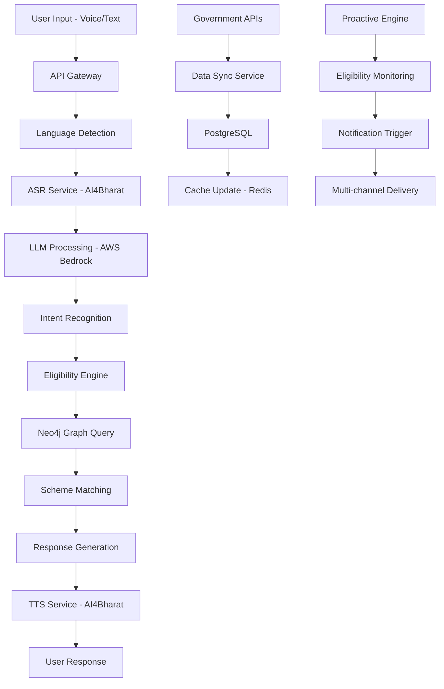
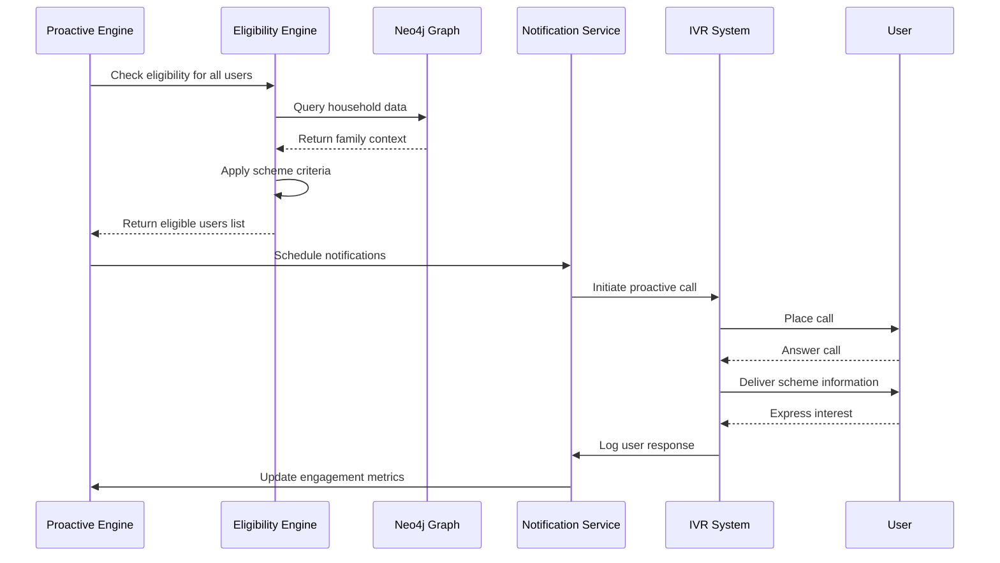
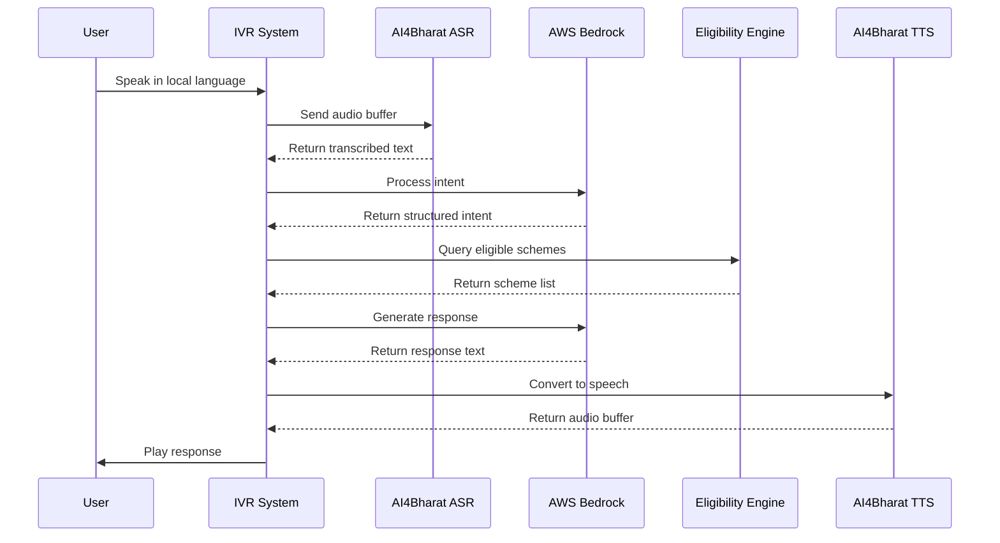

# Design Document: SchemaSetu

## Overview

SchemaSetu is a multilingual, voice-first AI platform designed to bridge the gap between eligible citizens and government welfare schemes in India. The system employs a proactive approach, using AI to identify eligible citizens and initiate contact through their preferred communication channels. The platform supports 22 Indian languages and 40 dialects, operates efficiently on 2G networks, and maintains comprehensive household context through graph database technology.

The core innovation lies in transforming the traditional reactive model of scheme discovery into a proactive system that actively reaches out to citizens when they become eligible for benefits. This approach addresses the critical problem where 78 million eligible citizens miss out on ₹1.2 trillion in government benefits annually.

## Architecture

### 5-Layer Architecture

The system follows a layered architecture approach that ensures scalability, maintainability, and clear separation of concerns:

**Layer 1: User Interface Layer**
- WhatsApp Bot for smartphone users
- IVR System for feature phone users
- Web Portal for desktop access
- Mobile App for smartphone users
- Field Agent Portal for assisted access

**Layer 2: API Gateway Layer**
- AWS API Gateway for request routing and rate limiting
- Authentication and authorization
- Request/response transformation
- Load balancing and traffic management

**Layer 3: AI Processing Layer**
- AI4Bharat ASR/TTS services for speech processing
- AWS Bedrock LLM for natural language understanding
- Language detection and dialect recognition
- Conversation management and context preservation

**Layer 4: Intelligence & Memory Layer**
- ML Eligibility Engine for scheme matching
- Neo4j Graph Database for household relationships
- Rules Engine for complex eligibility criteria
- Proactive notification system

**Layer 5: Integration & Data Layer**
- Government API integrations
- PostgreSQL for structured data
- Redis for caching and session management
- AWS S3 for document storage

### Data Flow Architecture



## Components and Interfaces

### Frontend Components

**WhatsApp Bot Interface**
- Built using WhatsApp Business API
- Supports voice messages, text, and document sharing
- Maintains conversation context across sessions
- Handles media uploads for document verification
- Implements webhook-based message processing

**IVR System Interface**
- Asterisk-based telephony system
- DTMF navigation for non-voice interactions
- Call recording for quality assurance
- Automatic call distribution for load balancing
- Integration with telecom carrier APIs

**Web Portal Interface**
- React-based responsive web application
- WCAG 2.1 AA accessibility compliance
- Progressive Web App (PWA) capabilities
- Offline functionality with service workers
- Multi-language support with i18n framework

**Mobile App Interface**
- React Native cross-platform application
- Offline-first architecture with local storage
- Push notification support
- Biometric authentication
- Camera integration for document capture

### AI Engine Components

**Speech Processing Service**
```typescript
interface SpeechService {
  recognizeSpeech(audioBuffer: Buffer, language: string): Promise<string>
  synthesizeSpeech(text: string, language: string, voice: string): Promise<Buffer>
  detectLanguage(audioBuffer: Buffer): Promise<LanguageDetection>
  validateAudioQuality(audioBuffer: Buffer): Promise<QualityMetrics>
}
```

**Natural Language Understanding Service**
```typescript
interface NLUService {
  extractIntent(text: string, context: ConversationContext): Promise<Intent>
  extractEntities(text: string, language: string): Promise<Entity[]>
  generateResponse(intent: Intent, context: UserContext): Promise<string>
  translateText(text: string, fromLang: string, toLang: string): Promise<string>
}
```

**Conversation Management Service**
```typescript
interface ConversationManager {
  initializeSession(userId: string, channel: string): Promise<Session>
  updateContext(sessionId: string, context: ConversationContext): Promise<void>
  getConversationHistory(userId: string, limit: number): Promise<Message[]>
  handleContextSwitch(sessionId: string, newChannel: string): Promise<void>
}
```

### Backend Components

**Eligibility Engine**
```typescript
interface EligibilityEngine {
  evaluateEligibility(userId: string, schemeId: string): Promise<EligibilityResult>
  findEligibleSchemes(householdId: string): Promise<Scheme[]>
  calculateBenefitAmount(userId: string, schemeId: string): Promise<number>
  validateEligibilityCriteria(criteria: EligibilityCriteria, userData: UserData): Promise<boolean>
}
```

**Proactive Notification Service**
```typescript
interface ProactiveService {
  scheduleEligibilityCheck(userId: string, frequency: string): Promise<void>
  triggerProactiveNotification(userId: string, schemes: Scheme[]): Promise<void>
  manageNotificationPreferences(userId: string, preferences: NotificationPrefs): Promise<void>
  trackNotificationDelivery(notificationId: string): Promise<DeliveryStatus>
}
```

**Government Integration Service**
```typescript
interface GovIntegrationService {
  submitApplication(application: Application): Promise<ApplicationResult>
  checkApplicationStatus(applicationId: string): Promise<ApplicationStatus>
  syncSchemeData(): Promise<void>
  validateDocuments(documents: Document[]): Promise<ValidationResult>
}
```

## Data Models

### Neo4j Graph Database Schema

The household memory graph uses Neo4j to model complex family relationships and dependencies:

**Node Types:**
```cypher
// Person node with comprehensive attributes
CREATE CONSTRAINT person_id FOR (p:Person) REQUIRE p.id IS UNIQUE;

(:Person {
  id: string,
  name: string,
  age: integer,
  gender: string,
  aadhar_number: string (encrypted),
  phone_number: string,
  preferred_language: string,
  dialect: string,
  education_level: string,
  occupation: string,
  income: integer,
  disability_status: string,
  created_at: datetime,
  updated_at: datetime
})

// Household node for family grouping
(:Household {
  id: string,
  address: string,
  district: string,
  state: string,
  pincode: string,
  household_income: integer,
  bpl_status: boolean,
  land_ownership: string,
  house_type: string,
  created_at: datetime
})

// Scheme node for government programs
(:Scheme {
  id: string,
  name: string,
  description: string,
  department: string,
  state: string,
  benefit_amount: integer,
  application_deadline: date,
  eligibility_criteria: string,
  required_documents: [string],
  active: boolean
})

// Application node for tracking submissions
(:Application {
  id: string,
  scheme_id: string,
  status: string,
  submitted_at: datetime,
  documents_verified: boolean,
  benefit_amount: integer,
  disbursement_date: date
})
```

**Relationship Types:**
```cypher
// Family relationships
(:Person)-[:PARENT_OF]->(:Person)
(:Person)-[:CHILD_OF]->(:Person)
(:Person)-[:SPOUSE_OF]->(:Person)
(:Person)-[:SIBLING_OF]->(:Person)
(:Person)-[:GUARDIAN_OF]->(:Person)

// Household membership
(:Person)-[:MEMBER_OF]->(:Household)
(:Person)-[:HEAD_OF]->(:Household)

// Scheme interactions
(:Person)-[:ELIGIBLE_FOR]->(:Scheme)
(:Person)-[:APPLIED_FOR]->(:Scheme)
(:Person)-[:BENEFICIARY_OF]->(:Scheme)

// Application tracking
(:Person)-[:SUBMITTED]->(:Application)
(:Application)-[:FOR_SCHEME]->(:Scheme)
```

### PostgreSQL Relational Schema

**Users Table:**
```sql
CREATE TABLE users (
    id UUID PRIMARY KEY DEFAULT gen_random_uuid(),
    phone_number VARCHAR(15) UNIQUE NOT NULL,
    preferred_language VARCHAR(10) NOT NULL,
    dialect VARCHAR(20),
    registration_date TIMESTAMP DEFAULT CURRENT_TIMESTAMP,
    last_active TIMESTAMP,
    notification_preferences JSONB,
    privacy_settings JSONB,
    created_at TIMESTAMP DEFAULT CURRENT_TIMESTAMP,
    updated_at TIMESTAMP DEFAULT CURRENT_TIMESTAMP
);
```

**Schemes Table:**
```sql
CREATE TABLE schemes (
    id UUID PRIMARY KEY DEFAULT gen_random_uuid(),
    name VARCHAR(255) NOT NULL,
    description TEXT,
    department VARCHAR(100),
    state_code VARCHAR(2),
    district_codes TEXT[], -- Array of applicable districts
    eligibility_criteria JSONB NOT NULL,
    required_documents JSONB,
    benefit_amount DECIMAL(12,2),
    application_deadline DATE,
    is_active BOOLEAN DEFAULT true,
    created_at TIMESTAMP DEFAULT CURRENT_TIMESTAMP,
    updated_at TIMESTAMP DEFAULT CURRENT_TIMESTAMP
);
```

**Applications Table:**
```sql
CREATE TABLE applications (
    id UUID PRIMARY KEY DEFAULT gen_random_uuid(),
    user_id UUID REFERENCES users(id),
    scheme_id UUID REFERENCES schemes(id),
    household_id UUID,
    application_data JSONB NOT NULL,
    status VARCHAR(50) DEFAULT 'submitted',
    submitted_at TIMESTAMP DEFAULT CURRENT_TIMESTAMP,
    processed_at TIMESTAMP,
    government_reference_id VARCHAR(100),
    documents JSONB,
    created_at TIMESTAMP DEFAULT CURRENT_TIMESTAMP,
    updated_at TIMESTAMP DEFAULT CURRENT_TIMESTAMP
);
```

**Conversations Table:**
```sql
CREATE TABLE conversations (
    id UUID PRIMARY KEY DEFAULT gen_random_uuid(),
    user_id UUID REFERENCES users(id),
    channel VARCHAR(20) NOT NULL, -- 'whatsapp', 'ivr', 'web', 'mobile'
    session_id VARCHAR(100),
    messages JSONB NOT NULL,
    context JSONB,
    started_at TIMESTAMP DEFAULT CURRENT_TIMESTAMP,
    ended_at TIMESTAMP,
    created_at TIMESTAMP DEFAULT CURRENT_TIMESTAMP
);
```

**Notifications Table:**
```sql
CREATE TABLE notifications (
    id UUID PRIMARY KEY DEFAULT gen_random_uuid(),
    user_id UUID REFERENCES users(id),
    type VARCHAR(50) NOT NULL, -- 'proactive', 'status_update', 'reminder'
    channel VARCHAR(20) NOT NULL,
    content JSONB NOT NULL,
    scheduled_at TIMESTAMP,
    sent_at TIMESTAMP,
    delivery_status VARCHAR(20) DEFAULT 'pending',
    retry_count INTEGER DEFAULT 0,
    created_at TIMESTAMP DEFAULT CURRENT_TIMESTAMP
);
```

### Key API Endpoints

**User Management APIs:**
```typescript
POST /api/v1/users/register
GET /api/v1/users/{userId}/profile
PUT /api/v1/users/{userId}/preferences
DELETE /api/v1/users/{userId}
```

**Conversation APIs:**
```typescript
POST /api/v1/conversations/start
POST /api/v1/conversations/{sessionId}/message
GET /api/v1/conversations/{sessionId}/history
PUT /api/v1/conversations/{sessionId}/context
```

**Scheme Discovery APIs:**
```typescript
GET /api/v1/schemes/eligible/{userId}
GET /api/v1/schemes/{schemeId}/details
POST /api/v1/schemes/eligibility-check
GET /api/v1/schemes/search
```

**Application Management APIs:**
```typescript
POST /api/v1/applications/submit
GET /api/v1/applications/{applicationId}/status
PUT /api/v1/applications/{applicationId}/documents
GET /api/v1/applications/user/{userId}
```

**Proactive Notification APIs:**
```typescript
POST /api/v1/notifications/schedule
GET /api/v1/notifications/{userId}/pending
PUT /api/v1/notifications/{notificationId}/delivered
POST /api/v1/notifications/bulk-trigger
```

### Sequence Diagrams

**Proactive Notification Flow:**


**Voice Interaction Flow:**


## Technology Stack Justification

**AI4Bharat for Speech Processing:**
- Specialized in Indian languages with support for 22 official languages
- IndicConformer models provide >95% accuracy for Indian language ASR
- IndicParlerTTS offers natural-sounding synthesis with dialect support
- Open-source models allow customization for specific use cases
- Research-backed by IIT Madras with continuous improvements

**AWS Bedrock for LLM Processing:**
- Provides access to multiple foundation models (Claude, Llama, etc.)
- Built-in multilingual capabilities with strong Indian language support
- Serverless architecture reduces operational overhead
- Enterprise-grade security and compliance features
- Pay-per-use pricing model suitable for variable workloads

**Neo4j for Household Relationships:**
- Graph structure naturally represents family relationships
- Efficient traversal queries for complex eligibility rules
- ACID compliance ensures data consistency
- Cypher query language simplifies relationship queries
- Horizontal scaling capabilities for large datasets

**PostgreSQL for Structured Data:**
- JSONB support for flexible schema evolution
- Strong consistency and ACID properties
- Excellent performance for complex queries
- Rich ecosystem of extensions and tools
- Cost-effective for structured data storage

**Redis for Caching:**
- In-memory performance for session management
- Pub/sub capabilities for real-time notifications
- Data structures optimized for caching patterns
- High availability with Redis Cluster
- Seamless integration with application stack

## Correctness Properties

*A property is a characteristic or behavior that should hold true across all valid executions of a system—essentially, a formal statement about what the system should do. Properties serve as the bridge between human-readable specifications and machine-verifiable correctness guarantees.*

Based on the prework analysis and property reflection, the following correctness properties ensure SchemaSetu operates correctly across all scenarios:

### Property 1: Speech Recognition Accuracy
*For any* audio input in supported languages and dialects, the Voice_Interface should achieve >95% accuracy in speech-to-text conversion when audio quality meets minimum standards
**Validates: Requirements 1.1**

### Property 2: Language Detection Consistency
*For any* user interaction, the Voice_Interface should automatically detect and consistently use the same language and dialect throughout the conversation session
**Validates: Requirements 1.3**

### Property 3: Fallback Activation on ASR Failure
*For any* voice interaction where ASR confidence falls below threshold, the System should automatically provide IVR keypad navigation options
**Validates: Requirements 1.4**

### Property 4: Continuous Conversation Flow
*For any* multi-turn conversation, the Voice_Interface should maintain context without requiring wake word repetition between turns
**Validates: Requirements 1.5**

### Property 5: Proactive Notification Timing
*For any* citizen who becomes eligible for schemes, the Proactive_AI should initiate contact within the specified timeframe (24 hours for eligibility, 5 minutes for missed calls, 1 hour for data sync)
**Validates: Requirements 2.1, 8.2, 10.2**

### Property 6: Communication Channel Preference Compliance
*For any* proactive notification, the System should use the citizen's preferred communication channel as specified in their profile
**Validates: Requirements 2.2**

### Property 7: Household Re-evaluation Triggers
*For any* change in household circumstances or family member status, the System should trigger complete re-evaluation of scheme eligibility for all household members
**Validates: Requirements 2.3, 3.3**

### Property 8: Notification Prioritization Logic
*For any* user with multiple eligible schemes, the System should prioritize notifications based on benefit amount and application deadlines in descending order
**Validates: Requirements 2.4**

### Property 9: Retry Logic Compliance
*For any* failed contact attempt, the Proactive_AI should maintain logs and retry up to 3 times over 7 days with exponential backoff
**Validates: Requirements 2.5**

### Property 10: Household Data Completeness
*For any* family information provided by users, the Household_Memory_Graph should store all relationships, demographics, and eligibility factors without data loss
**Validates: Requirements 3.1**

### Property 11: Comprehensive Eligibility Evaluation
*For any* eligibility assessment, the System should consider household income, family composition, and individual member characteristics in the calculation
**Validates: Requirements 3.2**

### Property 12: Historical Data Integrity and Duplicate Prevention
*For any* application attempt, the System should check historical data and prevent duplicate applications for the same scheme and user
**Validates: Requirements 3.4**

### Property 13: Privacy-Compliant Data Access
*For any* household data request, the System should respect privacy settings and return only information authorized for the requesting user
**Validates: Requirements 3.5**

### Property 14: Multi-Channel Feature Parity
*For any* system functionality, all channels (WhatsApp, IVR, Web, Mobile) should provide identical capabilities and produce equivalent results
**Validates: Requirements 4.1**

### Property 15: Cross-Channel Context Preservation
*For any* user switching communication channels mid-conversation, the System should maintain complete conversation context and history
**Validates: Requirements 4.2**

### Property 16: WhatsApp Multi-Media Support
*For any* WhatsApp interaction, the System should properly handle voice messages, text messages, and document sharing
**Validates: Requirements 4.4**

### Property 17: Application Flow Completeness
*For any* scheme application, the System should guide users through all required fields using voice prompts and validate completeness before submission
**Validates: Requirements 5.1**

### Property 18: Document Handling Flexibility
*For any* application requiring documents, the System should offer both WhatsApp photo upload and physical upload center options
**Validates: Requirements 5.2**

### Property 19: Form State Persistence
*For any* incomplete application form, the System should save progress and allow users to resume from the exact point of interruption
**Validates: Requirements 5.3**

### Property 20: Application Confirmation and Tracking
*For any* submitted application, the System should provide unique confirmation numbers and enable status tracking throughout the process
**Validates: Requirements 5.4**

### Property 21: Real-Time Input Validation
*For any* user input during application process, the System should validate data in real-time and provide immediate feedback for corrections
**Validates: Requirements 5.5**

### Property 22: Response Time Performance
*For any* user query under normal load conditions, the System should respond within 200ms for 95% of requests
**Validates: Requirements 6.1**

### Property 23: 2G Network Optimization
*For any* query session on 2G networks, the System should limit total data usage to less than 500KB including all API calls and responses
**Validates: Requirements 6.2**

### Property 24: Auto-Scaling Response Time
*For any* system load increase, the Auto_Scaling_Service should provision additional resources within 60 seconds
**Validates: Requirements 6.4**

### Property 25: Data Security Compliance
*For any* stored user data, the System should apply AES-256 encryption to all PII and ensure processing occurs within Indian data centers
**Validates: Requirements 7.1, 7.2**

### Property 26: Data Deletion Compliance
*For any* user data deletion request, the System should remove all personal information completely within 30 days
**Validates: Requirements 7.3**

### Property 27: Administrative Access Control
*For any* administrative function access attempt, the System should enforce role-based access control with multi-factor authentication
**Validates: Requirements 7.4**

### Property 28: Breach Notification Timing
*For any* detected data breach, the System should notify all affected users within 72 hours
**Validates: Requirements 7.5**

### Property 29: Offline IVR Functionality
*For any* user interaction when internet is unavailable, the IVR_System should provide complete voice-based functionality over standard phone calls
**Validates: Requirements 8.1**

### Property 30: Offline Data Synchronization
*For any* user request made during connectivity issues, the System should queue requests locally and process them when connectivity is restored
**Validates: Requirements 8.3, 8.5**

### Property 31: SMS Notification Capability
*For any* status update for users without smartphone access, the System should deliver notifications via SMS
**Validates: Requirements 8.4**

### Property 32: Multilingual Content Management
*For any* new scheme addition, the Content_Management_System should support input and maintain consistency across all 22 supported languages
**Validates: Requirements 9.1, 9.2, 9.3, 9.4**

### Property 33: Location-Based Content Delivery
*For any* user request, the System should provide location-specific content based on the user's state and district information
**Validates: Requirements 9.5**

### Property 34: Government API Integration Reliability
*For any* government API interaction, the Integration_Layer should handle authentication, rate limiting, and automatic retry with queuing during downtime
**Validates: Requirements 10.1, 10.5**

### Property 35: Application Forwarding and Tracking
*For any* submitted application, the System should forward it to appropriate government portals and maintain tracking throughout the process
**Validates: Requirements 10.3**

### Property 36: Audit Logging Completeness
*For any* government system interaction, the System should maintain complete audit logs for compliance purposes
**Validates: Requirements 10.4**

### Property 37: Privacy-Preserving Analytics
*For any* user interaction, the Analytics_Engine should track engagement metrics while preserving user privacy and not exposing PII
**Validates: Requirements 11.1**

### Property 38: Comprehensive Reporting
*For any* generated report, the System should include insights on scheme popularity, application success rates, and demographic patterns
**Validates: Requirements 11.2**

### Property 39: Automated Report Generation
*For any* scheduled reporting period, the System should automatically generate and deliver reports to government stakeholders
**Validates: Requirements 11.3**

### Property 40: Trend Analysis and Recommendations
*For any* system usage analysis, the System should identify underutilized schemes and provide actionable outreach strategy suggestions
**Validates: Requirements 11.4**

### Property 41: Real-Time Dashboard Updates
*For any* system activity or health metric change, the Reporting_System should update real-time dashboards immediately
**Validates: Requirements 11.5**

### Property 42: Agent Dashboard Completeness
*For any* field agent login, the Agent_Portal should display assigned citizens and their current scheme eligibility status
**Validates: Requirements 12.1**

### Property 43: Agent Authorization and Proxy Applications
*For any* agent-initiated application, the System should verify proper authorization before allowing proxy application submission
**Validates: Requirements 12.2**

### Property 44: Agent Performance Tracking
*For any* agent activity, the System should track performance metrics and citizen satisfaction scores for management reporting
**Validates: Requirements 12.3**

### Property 45: Agent Portal Offline Capability
*For any* agent working in areas with poor connectivity, the Agent_Portal should provide offline functionality with data synchronization when connectivity returns
**Validates: Requirements 12.4**

### Property 46: Agent Training and Certification
*For any* new agent onboarding, the System should provide interactive tutorials and track certification progress
**Validates: Requirements 12.5**

## Error Handling

The system implements comprehensive error handling across all layers:

**Voice Processing Errors:**
- ASR failures trigger automatic fallback to IVR keypad navigation
- TTS failures provide text-based alternatives through available channels
- Language detection failures default to user's registered preferred language
- Audio quality issues prompt users to retry or switch to text-based interaction

**Connectivity Errors:**
- Network timeouts trigger automatic retry with exponential backoff
- 2G optimization reduces payload size and implements aggressive caching
- Offline mode queues all requests for processing when connectivity returns
- IVR system provides complete functionality independent of internet connectivity

**Data Processing Errors:**
- Invalid input triggers real-time validation with specific error messages
- Database connection failures implement automatic failover to secondary instances
- Graph query errors fall back to relational database queries where possible
- Cache misses trigger background data refresh without blocking user interactions

**Integration Errors:**
- Government API failures queue requests for automatic retry
- Authentication failures trigger token refresh and retry mechanisms
- Rate limiting implements intelligent backoff and request distribution
- Document processing errors provide clear guidance for resubmission

**Security Errors:**
- Authentication failures lock accounts after 3 attempts with progressive delays
- Authorization violations are logged and trigger security alerts
- Data breach detection automatically notifies affected users and authorities
- Encryption failures prevent data storage and trigger system alerts

## Testing Strategy

SchemaSetu employs a dual testing approach combining unit tests for specific scenarios and property-based tests for comprehensive coverage:

**Unit Testing Focus:**
- Specific examples of voice interactions in different languages
- Edge cases for eligibility calculations with complex family structures
- Integration points between AI services and government APIs
- Error conditions and fallback mechanisms
- Security boundary testing with various attack vectors

**Property-Based Testing Configuration:**
- Minimum 100 iterations per property test to ensure statistical significance
- Each property test references its corresponding design document property
- Tag format: **Feature: schemasetu, Property {number}: {property_text}**
- Random generation of household structures, user profiles, and scheme configurations
- Automated testing of all 46 correctness properties with comprehensive input coverage

**Testing Infrastructure:**
- Continuous integration pipeline with automated property test execution
- Performance testing with simulated 2G network conditions
- Load testing with up to 1 million concurrent users in staging environment
- Security testing including penetration testing and vulnerability assessments
- Accessibility testing for WCAG 2.1 AA compliance verification

**Property Test Implementation:**
- Use Hypothesis for Python-based services
- Use fast-check for TypeScript/JavaScript components
- Custom generators for Indian language text, family structures, and government schemes
- Property tests validate universal correctness across all possible inputs
- Unit tests complement property tests by testing specific integration scenarios

The testing strategy ensures that SchemaSetu maintains correctness, performance, and security standards while serving millions of users across diverse linguistic and technological contexts.